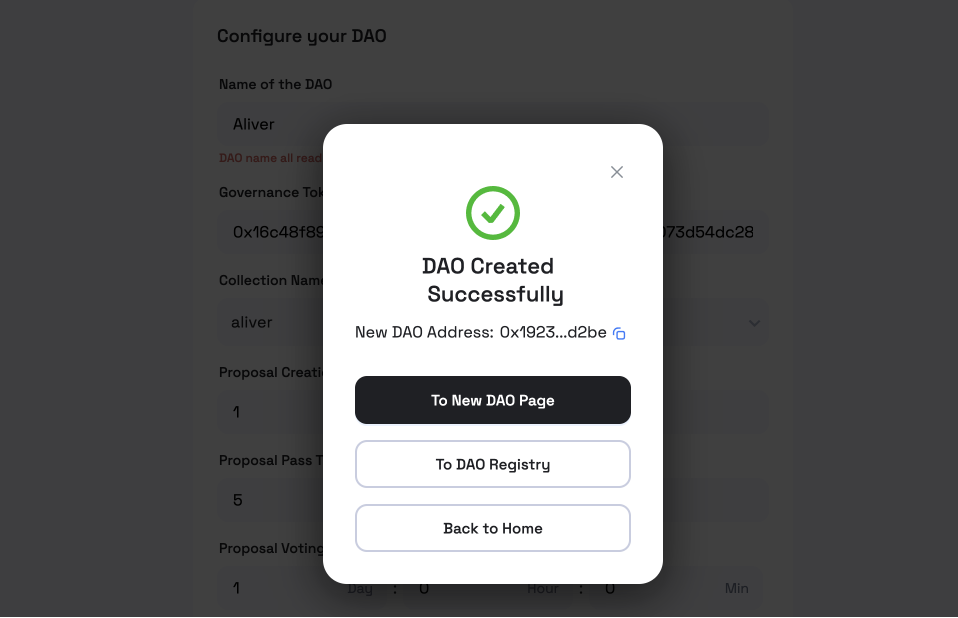

# aptos-nft-dao-registry

Registry of Aptos NFT DAOs.

# Adding a new DAO

## 1. Create Your DAO on [Order DAO](https://order.ariesmarkets.xyz)

- Complete the form to create a DAO.
- Save your DAO address when the creation succeed. It looks like as below:
  

Note: It will not appear in the OrderDAO's list immediately after you create it successfully. You need to add the DAO Registry for the off-chain information.

## 2. Add Registry

Clone this repo, checkout to a new branch to add registry.

```bash
git clone https://github.com/Aries-Markets/aptos-nft-dao-registry.git
git checkout -b [branch_name]
```

### 1. Upload DAO Images

- Add DAO images(eg. Logo, Backgroud Banner) to folder `release/images/`.
  For better distinguish, it is recommended to use `[DAO Name]-[usage]-[network].jpeg/png` format for image names.

```bash
# The Image Example:
$ ls -l release/images/
-rw-r--r--  1 Feb 21 14:41 lemur-lounge-bg-testnet.jpeg
-rw-r--r--  1 Feb 21 14:42 lemur-lounge-logo-testnet.jpeg
```

### 2. Add DAO Registry

- Add a new `dao.toml` to folder `registry/[network]/[DAO Name]/`.
  `registry/dao_template.toml` can be used as a template.

- Use the images you uploaded above as DAO's image URLs, the URL format should follow `https://raw.githubusercontent.com/Aries-Markets/aptos-nft-dao-registry/main/release/images/[Your Image File Name]`. You can also use images from other image hosting service.

```bash
# Image URL Example:
https://raw.githubusercontent.com/Aries-Markets/aptos-nft-dao-registry/main/release/images/lemur-lounge-logo-testnet.jpeg
```

- Then, you have completed the registry, pushed the changes to the remote branch and created a pull request, waiting for the PR to be merged into the main branch.

When the merge is complete, it will take **about five minutes** to display Your DAO in the OrderDAO's list.

Note:

> You can find more detail description about `**_uri_template.json` at [Aptos Dev Docs](https://aptos.dev/concepts/coin-and-token/aptos-token#storing-metadata-off-chain).

1. To use **token collection** as a `Governance Token`, you should supply **the collection uri** that points to a file follows the `registry/token_collection_uri_template.json` constraints when you create a collection on Aptos.
2. Also, to use **token** as `vote power` in DAO, you should ensure **the token uri** that points to a file follows the `registry/token_uri_template.json` constraints when you/(collection creator) mint new token upon the `Governance Token collection` .
